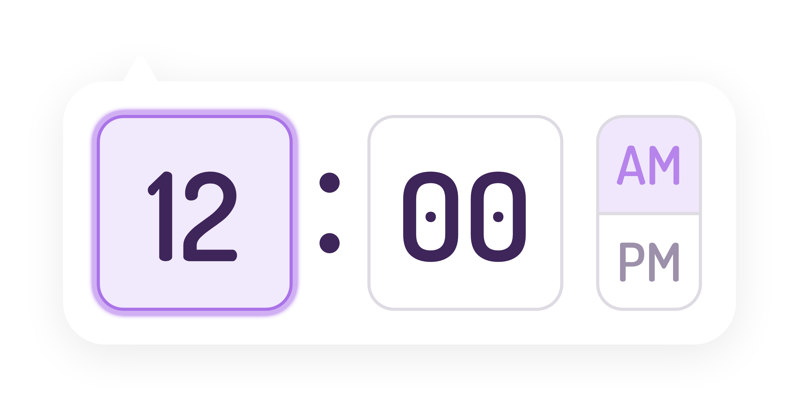

# PickTime

Minimal & Lightweight, JavaScript Time Picker.

## Features

- Lightweight
- No Dependencies
- Minimal Design
- Fully Customizable CSS

## Installation

#### **NPM**

```shell
npm i picktime
```

## Usage

```js
// Import
import PickTime from 'picktime';

// Initialize
new PickTime(inputElement);
```

> It only supports input (_type text_) elements as of now!

## Importing CSS

You will find CSS files in the `build/css` directory.

```js
import 'picktime/build/css/picktime.min.css';
```

## Options

PickTime provides you with several options to customize your time pickers.

- [animation](#animation)
- [clock](#)
- [displayTime](#)
- [format](#)
- [margin](#)
- [minuteSteps](#)
- [onKeys](#)
- [onWheel](#)
- [theme](#)

#### **`animation`**

`drop`

| Type   | Values       | Description                                                                                                                                            |
| ------ | ------------ | ------------------------------------------------------------------------------------------------------------------------------------------------------ |
| string | fade \| drop | Define opening animation. `fade` and `drop` are 2 values to choose from, but not limited to. Add a `customName` and define `css` for custom animation. |

Custom Animation:

Class `.picktime--animation--customName`

```css
.picktime--animation--customName {
  animation: 'value';
}
```

#### **`clock`**

`12`

| Type | Values   | Description                                |
| ---- | -------- | ------------------------------------------ |
| int  | 12 \| 24 | Set clock to 12-Hour Time or 24-Hour Time. |

#### **`displayTime`**

`12:00 AM`

| Type | Values                                    | Description                                                                           |
| ---- | ----------------------------------------- | ------------------------------------------------------------------------------------- |
| obj  | {hour: int, minute: int, meridiem: am/pm} | Set default time to display on the clock. It has nothing to do with the return value. |

#### **`format`**

`hh:mm A`

| Type   | Values                          | Description                                                      |
| ------ | ------------------------------- | ---------------------------------------------------------------- |
| string | combinations of h, m and a \| A | Returns a string formatted according to the given format string. |

#### **`margin`**

| Type | Values                | Description                                   |
| ---- | --------------------- | --------------------------------------------- |
| obj  | {top: int, left: int} | Place clock `x` value from top, left or both. |

#### **`minuteSteps`**

`1`

| Type | Values | Description                                                       |
| ---- | ------ | ----------------------------------------------------------------- |
| int  | 1-59   | Specifies steps by which minutes handle should increase/decrease. |

#### **`onKeys`**

`true`

| Type    | Values | Description                                                |
| ------- | ------ | ---------------------------------------------------------- |
| boolean | -      | Allow use of `ArrowUp` & `ArrowDown` keys on the keyboard. |

#### **`onWheel`**

`true`

| Type    | Values | Description                                |
| ------- | ------ | ------------------------------------------ |
| boolean | -      | Allow use of mouse wheel. (\* Recommended) |

#### **`theme`**

`light`

| Type   | Values        | Description                                                                                                                                                   |
| ------ | ------------- | ------------------------------------------------------------------------------------------------------------------------------------------------------------- |
| string | light \| dark | Sets theme of the picker. `light` and `dark` are themes to choose from, but not limited to. Add a `customName` and define css to customize as per your needs. |

CSS Options:

You can easily customize PickTime style by using and changing CSS variables.

```css
/* Main Container */
--pt-background: color;
--pt-borderColor: color;
--pt-borderRadius: value;
--pt-boxShadowColor: color;

/* Input */
--pt-input-color: color;
--pt-input-fontSize: value;
--pt-input-background: color;
--pt-input-borderColor: color;
--pt-input-borderRadius: value;
--pt-inputFocus-borderColor: color;
--pt-inputFocus-background: color;
--pt-inputFocus-boxShadowColor: color;

/* Dots */
--pt-dots-color: color;

/* Meridiem */
--pt-meridiem-borderColor: color;
--pt-meridiem-borderRadius: value;
--pt-meridiemLabel-borderColor: color;
--pt-meridiemSpan-color: color;
--pt-meridiemSpan-fontSize: value;
--pt-meridiemSpanHover-color: color;
--pt-meridiemSpanHover-background: color;
--pt-meridiemChecked-color: color;
--pt-meridiemChecked-background: color;
```

Custom Theme:

Class `.picktime--customName`

```css
.picktime--customName {
  --pt-background: #fff;
  --pt-borderColor: #000;
  --pt-borderRadius: 10px;
}
```

## License

[MIT License](https://) © Kumar Deepak
