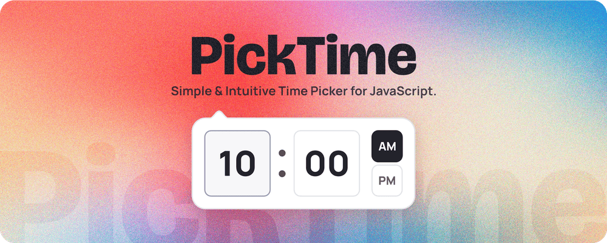

[](https://www.jsdelivr.com/package/npm/picktime)
[](https://github.com/kumardeepakme/picktime)

# PickTime

Simple & Intuitive Time Picker for JavaScript.

## Features

- 💡 Minimal & Intuitive Design
- 🖱️ Mouse Wheel Time Adjustment
- ⬆️ Up & Down Arrow Key Controls
- 🕒 12 & 24 Hour Clock Support
- ⏱️ Configurable Minute Steps
- ⏰ Predefined Time Settings
- 🛠️ Developer-Friendly Output
- 📍 Customizable Picker Position
- 🌙 Light & Dark Themes Available
- 🎨 Fully Customizable CSS

## Installation

#### **NPM**

```shell
npm i picktime
```

#### **Yarn**

```shell
yarn add picktime
```

#### **CDN**

Using jsDelivr CDN:

```html
<!-- CSS -->
<link rel="stylesheet" href="https://cdn.jsdelivr.net/npm/picktime/dist/picktime.min.css">

<!-- JS -->
<script src="https://cdn.jsdelivr.net/npm/picktime/dist/picktime.umd.js"></script>
```

Using unpkg CDN:

```html
<!-- CSS -->
<link rel="stylesheet" href="https://www.unpkg.com/browse/picktime@2.0.0/dist/picktime.min.css">

<!-- JS -->
<script src="https://www.unpkg.com/browse/picktime@2.0.0/dist/picktime.umd.js"></script>
```

## Usage

```js
import 'picktime/dist/picktime.min.css';

import { PickTime } from 'picktime';

const picktime = new PickTime(inputTextElement, { options });
```

## Options

PickTime offers a variety of options to customize your time picker to suit your needs.

- [animation](#animation)
- [arrow](#arrow)
- [clock](#clock)
- [minuteSteps](#minutesteps)
- [offset](#offset)
- [theme](#theme)
- [time](#time)
- [upDownKeys](#updownkeys)
- [wheelSpin](#wheelspin)

### **`animation`**

Type: `string`<br>
Values: `drop` (default) | `fade` | `string`

✨ Define the opening animation of the picker.

Example:

```js
const picktime = new PickTime(inputTextElement, {
  animation: 'drop' // or "fade"
});
```

Additionally, you can specify a custom animation name to apply your own animation. Below is an example of how to use the `animation` option to set a custom animation.

- JavaScript

  ```js
  /*
   * Set the "animation" property with a custom value
   * For example - "flip"
   */
  const picktime = new PickTime(inputTextElement, {
    animation: 'flip'
  });
  ```

- CSS

  ```css
   /* 1. (if required) Add "prespective" to the parent container, i.e body in our case */
   body {
     perspective: 500px;
   }

   /* 2. Define the animation keyframes */
   @keyframes flip {
     0% {
       transform: rotateX(-80deg);
       opacity: 0;
     }
     100% {
       transform: rotateX(0);
       opacity: 1;
     }
   }

   /* 3. Define class .picktime--animation-NAMEHERE */
  .picktime--animation-flip {
    animation: flip 0.25s cubic-bezier(0.25, 0.46, 0.45, 0.94) both;
  }
  ```

### **`arrow`**

Type: `boolean`<br>
Values: `true` (default) | `false`

✨ Enable or disable arrow indicator in the picker.

Example:

```js
const picktime = new PickTime(inputTextElement, {
  arrow: true // or false
});
```

### **`clock`**

Type: `number`<br>
Values: `12` (default) | `24`

✨ Set the clock format. Choose between a 12-hour or 24-hour clock.

Example:

```js
const picktime = new PickTime(inputTextElement, {
  clock: 24 // or 12
});
```

### **`minuteSteps`**

Type: `number`<br>
Values: `1` (default) | `1 - 59`

✨ Define the step interval for minutes selection.

Example:

```js
const picktime = new PickTime(inputTextElement, {
  minuteSteps: 5 // Set the step interval (e.g., 1, 5, 10)
});
```

### **`offset`**

Type: `object`<br>

- `left` - Horizontal offset
  - Type: `number`<br>
    Values: `0` (default) | `+ve integer`
- `top` - Vertical offset
  - Type: `number`<br>
    Values: `2` (default) | `+ve integer`

✨ Set the offset position of the picker relative to the input element.

Example:

```js
const picktime = new PickTime(inputTextElement, {
  offset: {
    left: 10, // Horizontal offset
    top: 10  // Vertical offset
  }
});
```

### **`theme`**

Type: `string`<br>
Values: `light` (default) | `dark` | `string`

✨ Apply a theme to the picker.

Example:

```js
const picktime = new PickTime(inputTextElement, {
  theme: 'dark' // or "light"
});
```

Additionally, you have complete control over the CSS and can create a custom theme. To do this, simply override the CSS variables listed below with your desired values:

```css
/* Main */
--pt-background: color;
--pt-foreground: color;

/* PickTime */
--pt-border-color: color;
--pt-box-shadow-color: color;

/* Input */
--pt-input-color: color;
--pt-input-background: color;
--pt-input-border-color: color;
--pt-input-focus-border-color: color;
--pt-input-focus-background: color;

/* Dots */
--pt-dots-color: color;

/* Meridiem */
--pt-meridiem-color: color;
--pt-meridiem-hover-color: color;
--pt-meridiem-hover-background: color;
--pt-meridiem-border-color: color;
--pt-meridiem-checked-color: color;
--pt-meridiem-checked-background: color;
--pt-meridiem-checked-border-color: color;

/* PickTime */
--pt-padding: padding;
--pt-border-radius: radius;
--pt-border: width style color;
--pt-box-shadow: shadow;

/* Inputs */
--pt-input-font-size: size;
--pt-input-border-radius: radius;
--pt-input-border: width style color;

/* Meridiem */
--pt-meridiem-font-size: size;
--pt-meridiem-border-radius: radius;
--pt-meridiem-border: width style color;
```

Here is an example of how to define a custom theme.

- JavaScript

  ```js
  /*
   * Set the "theme" property with a custom value
   * For example - "kd"
   */
  const picktime = new PickTime(inputTextElement, {
    theme: 'kd'
  });
  ```

- CSS

  ```css
  /* Define class .picktime--theme-NAMEHERE */
  .picktime--theme-kd {
    /* Main */
    --pt-background: #274bce;
    --pt-foreground: #fff;

    /* PickTime */
    --pt-border-color: #1b338c;
    --pt-box-shadow-color: rgba(0, 0, 0, 0.2);

    /* Input */
    --pt-input-color: var(--pt-foreground);
    --pt-input-background: var(--pt-background);
    --pt-input-border-color: #1b338c;
    --pt-input-focus-border-color: var(--pt-foreground);
    --pt-input-focus-background: #213fad;

    /* Dots */
    --pt-dots-color: #1b338c;

    /* Meridiem */
    --pt-meridiem-color: var(--pt-foreground);
    --pt-meridiem-hover-color: var(--pt-foreground);
    --pt-meridiem-hover-background: #213fad;
    --pt-meridiem-border-color: var(--pt-input-border-color);
    --pt-meridiem-checked-color: var(--pt-foreground);
    --pt-meridiem-checked-background: #ff6e46;
    --pt-meridiem-checked-border-color: var(--pt-foreground);

    /* PickTime */
    --pt-padding: 10px;
    --pt-border-radius: 12px;
    --pt-border: 1px solid var(--pt-border-color);
    --pt-box-shadow: 0 1px 8px var(--pt-box-shadow-color);

    /* Inputs */
    --pt-input-font-size: 30px;
    --pt-input-border-radius: 10px;
    --pt-input-border: 1px solid var(--pt-input-border-color);

    /* Meridiem */
    --pt-meridiem-font-size: 10px;
    --pt-meridiem-border-radius: 50%;
    --pt-meridiem-border: 1px solid var(--pt-meridiem-border-color);
  }
  ```

  > 🚨 If you are specifying a custom theme, you must define all the CSS variables.

  > 🌟 Above theme colors are inspired by [kumardeepak.me](https://kumardeepak.me)

- Output

  > 🤩 Applying the above theme will result in this beautiful picker theme.

  

### **`time`**

Type: `object`<br>

- `hours` - Predefined hours
  - Type: `number`<br>
    Values: `10` (default) | `1 - 23`
- `minutes` - Predefined hours
  - Type: `number`<br>
    Values: `0` (default) | `0 - 59`
- `meridiem`
  - Type: `string | null`<br>
    Values: `am` (default) | `pm` | `null` (for 24-hour format)

✨ Predefine the time settings for the picker. Defaults to "10:00 AM"

Example:

```js
// Set "09:00 AM"
const picktime = new PickTime(inputTextElement, {
  time: {
    hours: 9, // Predefined hours
    minutes: 0, // Predefined minutes
    meridiem: 'am' // 'am', 'pm', or null for 24-hour format
  }
});
```

### **`upDownKeys`**

Type: `boolean`<br>
Values: `true` (default) | `false`

✨ Enable/Disable the use of up & down arrow keys for time adjustment.

Example:

```js
const picktime = new PickTime(inputTextElement, {
  upDownKeys: true // or false
});
```

### **`wheelSpin`**

Type: `boolean`<br>
Values: `true` (default) | `false`

✨ Enable/Disable mouse wheel controls for time adjustment.

Example:

```js
const picktime = new PickTime(inputTextElement, {
  wheelSpin: true // or false
});
```

## Methods

### **`setTime()`**

Returns: `void`<br>
Parameter: `object`

- `hours` - Predefined hours
  - Type: `number`<br>
    Values: `1 - 23`
- `minutes` - Predefined hours
  - Type: `number`<br>
    Values: `0 - 59`
- `meridiem` - am/pm
  - Type: `string | null`<br>
    Values: `am` | `pm` | `null` (for 24-hour format)

✨ Set the time properties of the picker after initialization.

Example:

```js
// Set time "02:30 PM" @ 12-Hour Clock
const picktime = new PickTime(inputTextElement);
picktime.setTime({ hours: 2, minutes: 30, meridiem: 'pm' });

// Set time "02:30 PM" @ 24-Hour Clock
const picktime = new PickTime(inputTextElement, { clock: 24 });
picktime.setTime({ hours: 14, minutes: 30 });
```

### **`disable()`**

Returns: `void`<br>
Parameters: None

✨ Disable the time picker, preventing user interaction.

Example:

```js
const picktime = new PickTime(inputTextElement);
picktime.disable();
```

### **`enable()`**

Returns: `void`<br>
Parameters: None

✨ Enable the time picker after it has been disabled.

Example:

```js
const picktime = new PickTime(inputTextElement);
picktime.enable();
```

### **`destroy()`**

Returns: `void`<br>
Parameters: None

✨ Destroy the time picker instance, removing it from the DOM and freeing up resources.

Example:

```js
const picktime = new PickTime(inputTextElement);
picktime.destroy();
```

## Getters

### **`getTime`**

Returns: `object`

- `displayTime` (`string`) - Formatted time string (e.g., "10:30 AM").
- `meridiem` (`string | null`) - Meridiem value ('am', 'pm', or null for 24-hour format).
- `time` (`string`) - Time string in HH format (e.g., "10:30").
- `utcOffset` (`string`) - UTC offset string (depends on the browser).

✨ Retrieve the current time from the picker.

Example:

```js
const picktime = new PickTime(inputTextElement);

inputTextElement.addEventListener('change', () => {
  console.log(picktime.getTime);
});
```

## License

[MIT License](https://github.com/kumardeepakme/picktime/blob/main/LICENCE.md) © Kumar Deepak

## Support Project

If this package added value to your project, please consider buying me a cup of coffee. 🙏

[](https://www.buymeacoffee.com/kumardeepakme)
